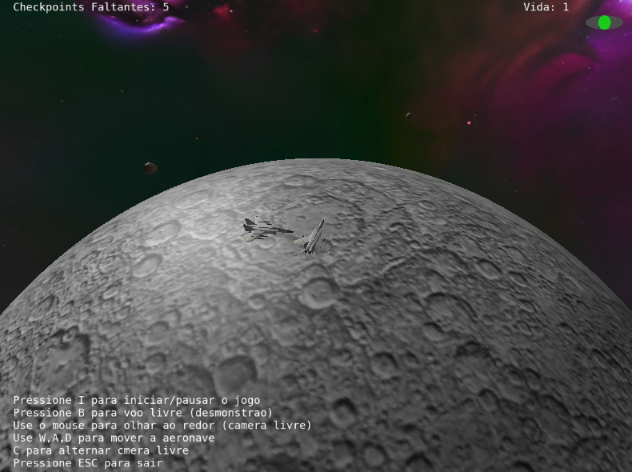
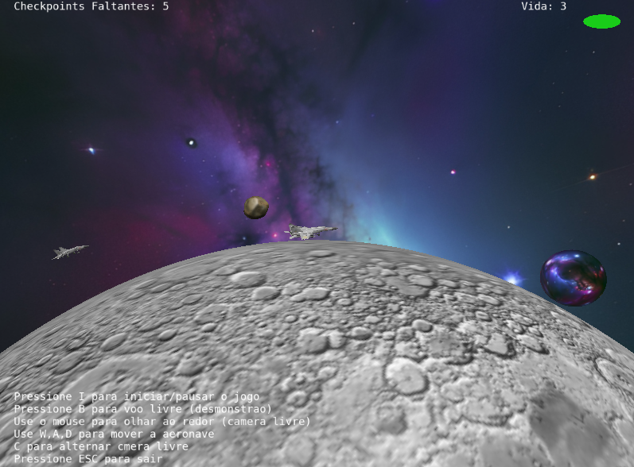

# Trabalho Final: Space Lunar Chase

Este projeto é uma **aplicação gráfica interativa** desenvolvida em C++ e OpenGL 3.3, seguindo os requisitos do trabalho final da disciplina de Fundamentos de Computação Gráfica (INF01047). O jogo simula uma perseguição espacial na órbita de uma lua, onde o jogador (a aeronave) deve coletar *checkpoints* enquanto desvia de asteroides e inimigos.

---

## Contribuição Individual

Este trabalho foi desenvolvido por mim, demonstrando o domínio de todos os conceitos de Computação Gráfica exigidos na especificação.

* **Artur**: Responsável por todo o desenvolvimento, incluindo a estrutura principal, lógica de jogo (movimento da nave, inimigos, mísseis), implementação de todos os algoritmos de colisão, ajustes de *shaders* para diferentes modelos de iluminação e texturização, e a integração final de todos os módulos.

---

##  Uso de Ferramentas de Inteligência Artificial

Utilizei a ferramenta **Gemini/ChatGPT** como um **poderoso assistente de programação e consulta**. A IA foi fundamental para **entender os cálculos complexos**, especialmente na base das transformações geométricas, calculo dos vetores da nave para orbitar em volta da lua, e auxiliar na **implementação dos algoritmos de colisão** (como o teste Cilindro-Esfera). Também auxiliou na lógica de *spawn* para **inimigos** e **checkpoints**.

A análise crítica é que a IA é um **bom apoio** e acelerou a compreensão conceitual. No entanto, ela **não foi/é capaz de desenvolver a complexidade total** do projeto por conta própria, na maioria das vezes saindo do escopo, exigindo intervenção e correção humana contínua. Em suma, é um bom apoio.

---

## Conceitos de Computação Gráfica Implementados

A aplicação foi desenvolvida focando na implementação dos conceitos estudados, conforme os requisitos do trabalho.

### 1. Modelos Geométricos e Instâncias
* **Malhas Poligonais Complexas:** Utilizei modelos complexos no formato OBJ, como a nave (`aircraft.obj`) e o asteroide (`asteroid.obj`).
* **Instâncias de Objetos:** O mesmo modelo da nave é instanciado para renderizar tanto a **aeronave do jogador** quanto os **inimigos**, variando a `Model matrix` e o `object_id`. Os **Asteroides Aleatórios** também são instâncias do modelo `asteroid.obj`.

### 2. Transformações e Câmeras
* **Transformações Geométricas:** As interações de movimento da nave (`W`, `A`, `D`) aplicam transformações de rotação e translação na **Model Matrix**, controladas pelo usuário em tempo real.
* **Controle de Câmeras Virtuais (Livre e Look-at):** O jogo oferece dois modos de câmera, alternáveis pela tecla `C`:
    * **Câmera Look-at (Terceira Pessoa):** Foco na nave, orbitando o ponto central (lua).
    * **Câmera Livre (Primeira Pessoa):** Posicionada no bico da nave, alinhada ao vetor *forward* da aeronave.

### 3. Animação e Movimentação
* **Animação Baseada no Tempo (Delta t):** Todas as movimentações (nave, inimigos, mísseis) são calculadas utilizando o tempo delta (`delta_t = tnow - tprev`), garantindo **consistência de velocidade** independente da taxa de quadros (FPS).
* **Curva de Bézier Cúbica:** Um asteroide se move ao longo de um caminho curvo definido por quatro pontos de controle, utilizando a função `evaluateBezier(p0, p1, p2, p3, t)`.

### 4. Testes de Intersecção
Os testes de colisão são realizados no arquivo `collisions.cpp` e são essenciais para a lógica de jogo, utilizando **três tipos distintos**:

1.  **Esfera-Esfera (`checkSphereSphereCollision`):** Usado para colisões entre **Nave vs. Inimigo** e **Míssil vs. Alvo**.
2.  **Raio-Esfera (`checkRaySphereCollision`):** Utilizado para a coleta de **Checkpoints**, testando a **trajetória** da nave contra a esfera do alvo.
3.  **Cilindro-Esfera (`checkCylinderSphereCollision`):** Utilizado para colisões entre **Nave vs. Asteroide** e **Míssil vs. Asteroide**.

### 5. Iluminação e Texturização
* **Modelos de Iluminação (Difusa e Blinn-Phong):** O `shader_fragment.glsl` implementa o modelo de iluminação **Blinn-Phong**, combinando termos ambiente, difuso e especular.
* **Modelos de Interpolação:**
    * **Phong (*per-pixel*):** Aplicado à **Aeronave** e aos **Inimigos** (`gouraud = false`), interpolando as normais no *rasterizador* e calculando a iluminação em cada fragmento.
    * **Gouraud (*per-vertex*):** Aplicado ao **Plano da Lua** e aos **Asteroides Aleatórios** (`gouraud = true`), calculando a iluminação no *Vertex Shader* e interpolando a cor resultante.
* **Mapeamento de Texturas:** **TODOS** os objetos da cena (Nave, Lua, Skybox, Inimigo, Asteroide) utilizam cores definidas por texturas.

---

## 📸 Imagens da Aplicação


* **Imagem 1:** Nave do jogador em órbita, mostrando um inimigo e a superfície da lua (plano) com iluminação Gouraud.



* **Imagem 2:** A nave desvia de um asteroide com o *Heads-Up Display* (HUD) de vida no canto superior direito, o texto informativo e um *checkpoint*.

---

## 🕹️ Manual de Utilização da Aplicação

| Tecla | Função | Detalhes |
| :--- | :--- | :--- |
| **W** | Acelerar / Avançar | Move a nave para frente na órbita. |
| **A** | Virar à Esquerda | Rotaciona o vetor *forward* da nave para a esquerda. |
| **D** | Virar à Direita | Rotaciona o vetor *forward* da nave para a direita. |
| **SPACE** | Atirar Míssil | Dispara um míssil (sujeito a um *cooldown* de 1 segundo). |
| **I** | Iniciar / Pausar Jogo | Inicia a lógica de jogo (movimentação de inimigos, colisão). |
| **C** | Alternar Câmera | Troca entre a Câmera Look-at (3ª pessoa) e a Câmera Livre (1ª pessoa). |
| **B** | Voo Livre | Alterna para o modo de voo livre de demonstração (desativa lógica de jogo). |
| **R** | Resetar Jogo | Reinicia a vida, a posição da nave e os *spawns* (inimigos, checkpoints, asteroides). |
| **ESC** | Fechar a Aplicação | Encerra o programa. |
| **Mouse (Esquerdo)** | Controlar Câmera | Rotação da câmera (Theta e Phi) na visão Look-at. |
| **Scroll** | Zoom | Ajusta a distância da câmera (`g_CameraDistance`). |

---

## 💻 Compilação e Execução

A aplicação foi desenvolvida utilizando C++ e OpenGL 3.3, com as bibliotecas **GLFW** (criação de janela), **GLAD** (carregador de funções OpenGL) e **GLM** (matemática de vetores e matrizes).

### Dependências
* CMake (para gerenciar o *build*).
* Um compilador C++ (GCC, Clang ou MSVC).

### Passos para Compilação (Linux/macOS)

1.  **Clonar o Repositório:**
    ```bash
    git clone https://github.com/ArturBDev/trabalho-fcg.git
    cd trabalho-fcg
    ```

2.  **Criar Diretório de Build e Configurar:**
    ```bash
    mkdir build
    cd build
    cmake ..
    ```

3.  **Compilar:**
    ```bash
    make
    ```

### Execução

Após a compilação bem-sucedida, o binário será gerado no diretório `build`.

```bash
# Navegue até o diretório do binário
./main
